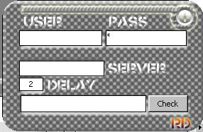



## mail notifiy

### Description

check this cool carbon fiber interface for a mail checker, it will notice you about new mail without need of a cpu hungry outlook.
 
### More Info
 

             |
---                |---
**Submitted On**   |2001-10-09 18:45:58
**By**             |[Fernando Zamora](https://github.com/Planet-Source-Code/PSCIndex/blob/master/ByAuthor/fernando-zamora.md)
**Level**          |Advanced
**User Rating**    |4.7 (14 globes from 3 users)
**Compatibility**  |VB 3\.0, VB 4\.0 \(16\-bit\), VB 4\.0 \(32\-bit\), VB 5\.0, VB 6\.0
**Category**       |[Complete Applications](https://github.com/Planet-Source-Code/PSCIndex/blob/master/ByCategory/complete-applications__1-27.md)
**World**          |[Visual Basic](https://github.com/Planet-Source-Code/PSCIndex/blob/master/ByWorld/visual-basic.md)
**Archive File**   |[mail notif2854710112001\.zip](https://github.com/Planet-Source-Code/fernando-zamora-mail-notifiy__1-27965/archive/master.zip)

